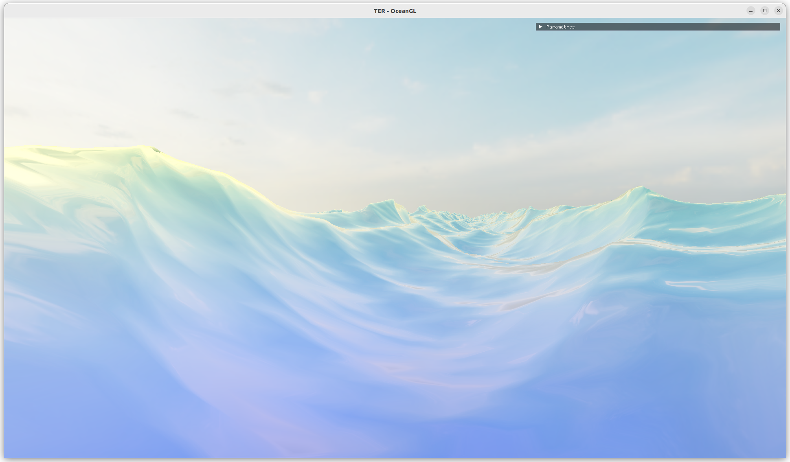
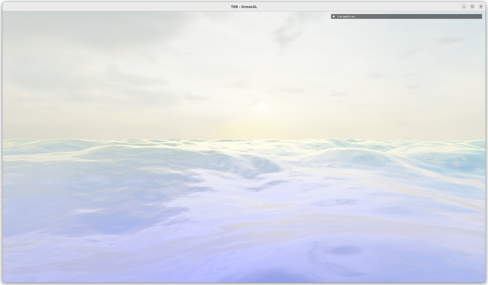
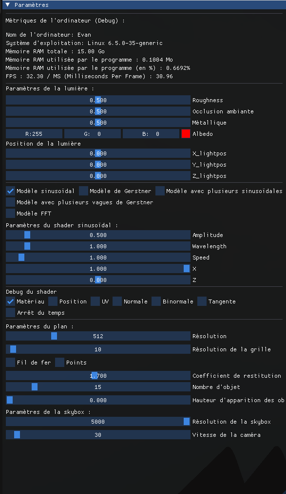

# OceanGL

**OceanGL** est un simulateur d'océan 3D en temps réel développé en C++ et en OpenGL dans le cadre de notre master d'Informatique parcours IMAGINE à l'Université de Montpellier. Ce projet met en œuvre plusieurs bibliothèques et outils, dont **GLFW**, **GLAD**, **GLM**, et **ImGui**. 

**OceanGL propose :**

- Simulation en temps réel d'un océan avec des modèles de vagues **sinusoïdales** et de **Gerstner**, avec skybox, prise en charge des réflexions, réfractions et du FBM
- Interface utilisateur avec **ImGui** permettant d'ajuster les paramètres de simulation.
- Mouvements de caméra fluides et interactifs pour explorer la simulation.

Pour plus d'informations, veuillez consulter notre [rapport de projet](Compte_rendu_TER_OceanGL.pdf).

<div align="center">
    
</div>

<div align="center">
    
</div>

## Instructions pour la compilation et l'exécution de l'application

### 1. Cloner le dépôt

Clonez le projet à l'aide de cette commande :

```bash
git clone git@github.com:louis-jean0/OceanGL.git
```

### 2. Compiler

```bash
mkdir build
cd build
cmake ..
make
```

### 3. Lancer l'application

```bash
./OceanGL
```

### 4. Contrôles

- **Z,Q,S,D** : déplacer la caméra
- **Espace / Ctrl** : respectivement monter / descendre la caméra
- **Mouvements de la souris** : rotation de la caméra
- **T** : faire apparaître le curseur de la souris
- **E** : faire disparaître le curseur de la souris
- **L** : faire apparaître les sphères flottantes

Pour jouer avec les différents paramètres de l'application, un menu interactif est à votre disposition.

<div align="center">
    
</div>

## Auteurs

- BÈS Jean-Baptiste
- COMBOT Evan
- JEAN Louis
- KERBAUL Loïc
