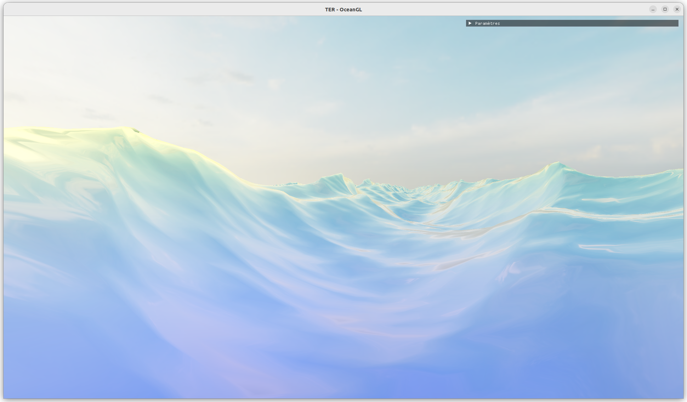
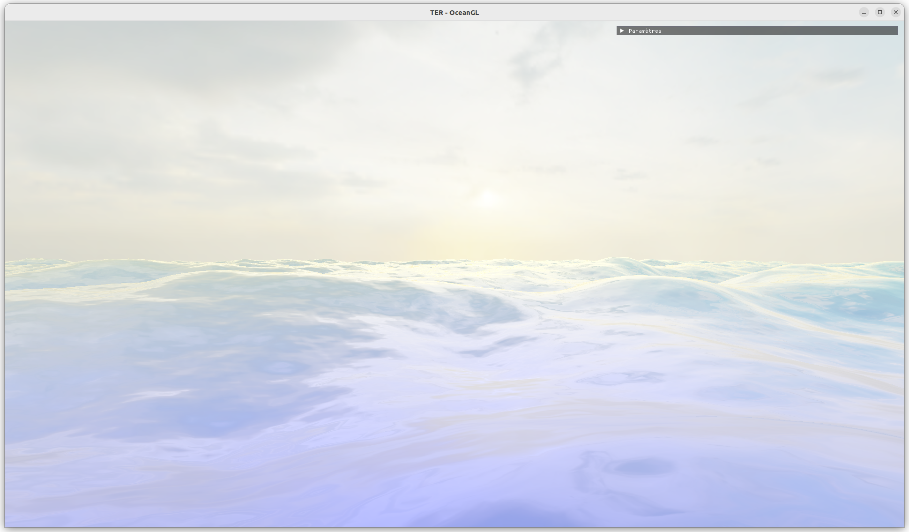
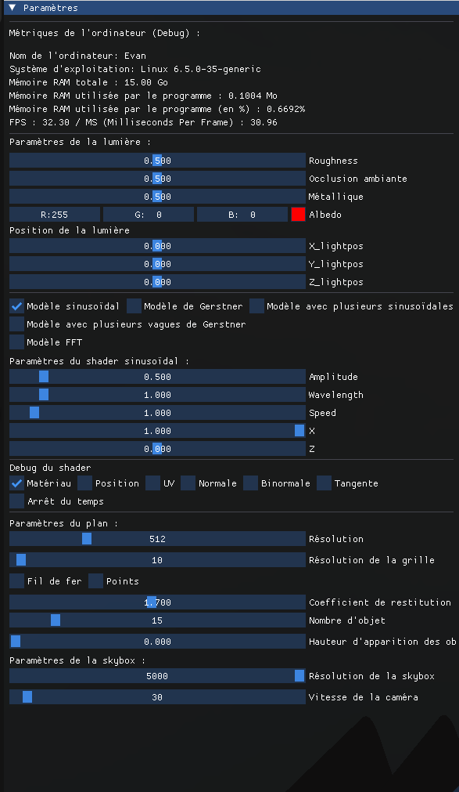

<div align="center">
   
   
   
</div>

# OceanGL

<div align="center">
    
</div>

<div align="center">
    
</div>

_Also available in [French](#-version-française)._

**OceanGL** is a real-time 3D ocean simulator developed from scratch in C++ and OpenGL. This project was built as part of the IMAGINE Computer Graphics Master's program at the University of Montpellier.

For a detailed technical breakdown, please see our [full project report (in French)](Compte_rendu_TER_OceanGL.pdf).

## Key features

- **Realistic wave simulation:** implementation of multiple mathematical models for wave generation, including classic **sinusoidal** waves and more advanced **Gerstner** waves for realistic sharp crests.
- **Advanced rendering effects:** a complete rendering pipeline featuring a dynamic skybox, real-time **reflections**, and **refractions**.
- **Procedural texturing:** water surface texturing using **Fractional Brownian Motion (FBM)** to add high-frequency detail and enhance realism.
- **Interactive control panel:** an in-game UI built with **ImGui** allows for real-time adjustment of all simulation parameters, such as wave amplitude, speed, and direction.
- **Free-fly camera:** smooth and interactive camera controls for exploring the scene from any angle.

<div align="center">
    
</div>

## Build & Run Instructions

### 1. Clone the repository
```bash
git clone git@github.com:louis-jean0/OceanGL.git
```

### 2. Compile
```bash
mkdir build
cd build
cmake ..
make
```

### 3. Run the application
```bash
./OceanGL
```

## Controls

- **WASD**: move the camera
- **Spacebar / Left Ctrl**: move camera up / down
- **Mouse Movement**: rotate the camera
- **T**: show mouse cursor
- **E**: hide mouse cursor
- **L**: toggle floating spheres

## License

This project is licensed under the MIT License - see the [LICENSE](LICENSE) file for details.

## Authors

- BÈS Jean-Baptiste
- COMBOT Evan
- JEAN Louis
- KERBAUL Loïc

---

<details>
<summary>:fr: Version française</summary>

#  Version française

# OceanGL

<div align="center">
    
</div>

<div align="center">
    
</div>

**OceanGL** est un simulateur d'océan 3D en temps réel développé en C++ et en OpenGL dans le cadre de notre master d'Informatique parcours IMAGINE à l'Université de Montpellier.

Pour plus d'informations, veuillez consulter notre [rapport de projet](Compte_rendu_TER_OceanGL.pdf).

### Fonctionnalités clés

- **Simulation de vagues réaliste:** implémentation de plusieurs modèles mathématiques pour la génération de vagues, incluant les vagues **sinusoïdales** classiques et les vagues de **Gerstner** plus avancées pour des crêtes plus marquées.
- **Effets de rendu avancés:** un pipeline de rendu complet intégrant une skybox dynamique, ainsi que des **réflexions** et **réfractions** en temps réel.
- **Texturage procédural:** la surface de l'eau est texturée en utilisant le **Fractional Brownian Motion (FBM)** pour ajouter des détails à haute fréquence et améliorer le réalisme.
- **Panneau de contrôle interactif:** une interface utilisateur construite avec **ImGui** permet d'ajuster en temps réel tous les paramètres de la simulation (amplitude, vitesse, direction des vagues, etc.).
- **Caméra libre:** des contrôles de caméra fluides et interactifs pour explorer la scène sous n'importe quel angle.

<div align="center">
    
</div>

### Instructions pour la compilation et l'exécution

#### 1. Cloner le dépôt
```bash
git clone git@github.com:louis-jean0/OceanGL.git
```

#### 2. Compiler
```bash
mkdir build
cd build
cmake ..
make
```

#### 3. Lancer l'application
```bash
./OceanGL
```

### Contrôles

- **Z,Q,S,D**: déplacer la caméra
- **Espace / Ctrl gauche**: respectivement monter / descendre la caméra
- **Mouvements de la souris**: rotation de la caméra
- **T**: faire apparaître le curseur de la souris
- **E**: faire disparaître le curseur de la souris
- **L**: faire apparaître les sphères flottantes

### Licence

Ce projet est sous licence MIT - consultez le fichier [LICENSE](LICENSE) pour plus de détails.

### Auteurs

- BÈS Jean-Baptiste
- COMBOT Evan
- JEAN Louis
- KERBAUL Loïc

</details>
